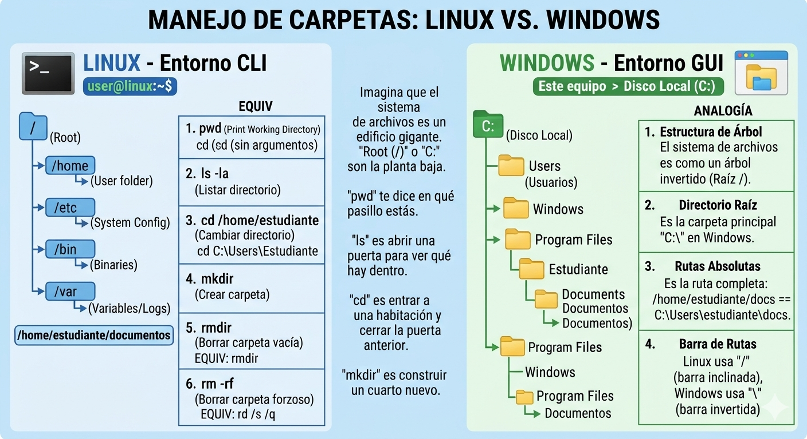

# 🐧 Guía Práctica de Comandos CLI de Linux (Hoja de Trucos)

Esta guía contiene los comandos indispensables de la interfaz de línea de comandos (CLI) de Linux estructurados para facilitar el aprendizaje.

---

### 📁 Manejo de Carpetas: Linux vs. Windows

Para entender cómo moverte en la terminal de Linux, piensa en la equivalencia con la interfaz gráfica de Windows que ya conoces:

#### 🗺️ Conceptos Clave de Estructura:
1. **El origen de todo (La Raíz):**
   * **En Windows:** Todo nace en el disco local, típicamente la unidad **`C:\`**.
   * **En Linux:** No existen letras de disco físicas para la raíz. Todo nace en una única barra inclinada llamada **Raíz (`/`)**. Es la base de todo el sistema.
2. **Tu Carpeta Personal (*Home*):**
   * **En Windows:** Tus archivos personales están guardados en `C:\Usuarios\TuNombre`.
   * **En Linux:** Equivale por completo a la ruta **`/home/tu_usuario`**. En la terminal, este directorio se suele representar de forma abreviada con una virgulilla (`~`).
3. **Las Barras de Ruta:**
   * **Windows** separa sus carpetas usando la barra invertida: `C:\Carpeta\Subcarpeta`.
   * **Linux** utiliza siempre la barra inclinada convencional: `/Carpeta/Subcarpeta`.

#### 🏢 La Analogía del Edificio:
* **`pwd` (Print Working Directory):** Es el mapa con el punto rojo que dice *"Usted está aquí"*. Te dice exactamente en qué pasillo del edificio estás parado.
* **`ls` (List):** Significa abrir los ojos y mirar. Te muestra qué puertas (carpetas) y cajas (archivos) hay en la habitación actual.
* **`cd` (Change Directory):** Es caminar hacia adelante, abrir una puerta y entrar a otro cuarto. Escribir `cd ..` significa salir por la puerta trasera para regresar al pasillo anterior.
* **`mkdir` (Make Directory):** Es levantar una nueva pared para añadir un cuarto vacío en el lugar exacto en el que te encuentras.

---

### 📊 Tablas de Comandos Más Usados

#### 📂 Navegación y Gestión de Archivos
| Comando | Descripción | Ejemplo Práctico | ¿Qué hace el ejemplo? |
| :--- | :--- | :--- | :--- |
| **`pwd`** | Muestra la ruta del directorio actual | `pwd` | Imprime la ubicación actual (Ej: `/home/estudiante`) |
| **`ls`** | Lista el contenido de un directorio | `ls -la` | Muestra todos los archivos, detalles y ocultos |
| **`cd`** | Cambia de directorio | `cd Documentos` | Te mueve al directorio dentro de "Documentos" |
| **`mkdir`**| Crea un nuevo directorio / carpeta | `mkdir Tareas` | Crea una carpeta llamada "Tareas" en la ruta actual |
| **`touch`**| Crea un archivo de texto vacío | `touch notas.txt` | Genera un archivo en blanco llamado "notas.txt" |
| **`cp`** | Copia archivos o carpetas | `cp -r notas.txt /tmp/` | Duplica el archivo dentro de la carpeta provisional `/tmp` |
| **`mv`** | Mueve o renombra archivos/carpetas| `mv notas.txt apuntes.txt`| Renombra "notas.txt" por "apuntes.txt" |
| **`rm`** | Elimina archivos o carpetas | `rm -rf CarpetaVieja` | Borra la carpeta y su contenido sin pedir confirmación |

#### 📄 Visualización y Edición de Texto
| Comando | Descripción | Ejemplo Práctico | ¿Qué hace el ejemplo? |
| :--- | :--- | :--- | :--- |
| **`cat`** | Muestra el contenido total de un archivo| `cat apuntes.txt` | Despliega todo el texto de apuntes en la terminal |
| **`head`**| Muestra el inicio de un archivo | `head -n 5 log.txt` | Lee únicamente las primeras 5 líneas del archivo |
| **`tail`**| Muestra el final de un archivo | `tail -f sistema.log` | Sigue en tiempo real las últimas líneas (ideal para logs) |
| **`grep`**| Busca un patrón de texto específico | `grep "error" log.txt` | Filtra y resalta cada línea que contenga "error" |
| **`nano`**| Editor de texto en consola sencillo | `nano tareas.txt` | Abre un editor directo para modificar texto velozmente |

#### 🛡️ Permisos y Configuración del Sistema
| Comando | Descripción | Ejemplo Práctico | ¿Qué hace el ejemplo? |
| :--- | :--- | :--- | :--- |
| **`sudo`** | Ejecuta comandos con rango root | `sudo apt update` | Descarga actualizaciones de software con privilegios |
| **`chmod`**| Configura los permisos de archivos | `chmod +x script.sh` | Convierte el archivo "script.sh" en un ejecutable |
| **`chown`**| Modifica el propietario del archivo | `sudo chown root log.txt`| Convierte al usuario root en dueño de "log.txt" |

#### 💻 Monitoreo de Procesos y Recursos
| Comando | Descripción | Ejemplo Práctico | ¿Qué hace el ejemplo? |
| :--- | :--- | :--- | :--- |
| **`htop`**| Panel visual de CPU y memoria | `htop` | Lanza el monitor dinámico interactivo en la pantalla |
| **`ps`** | Lista los procesos activos actuales | `ps aux` | Muestra de manera completa qué programas se ejecutan |
| **`kill`**| Detiene un proceso mediante su ID | `kill -9 1234` | Fuerza el apagado inmediato del programa con ID 1234 |
| **`df`** | Muestra almacenamiento en discos | `df -h` | Indica el espacio disponible estructurado en MB y GB |

#### 🌐 Conectividad, Redes y Descargas
| Comando | Descripción | Ejemplo Práctico | ¿Qué hace el ejemplo? |
| :--- | :--- | :--- | :--- |
| **`ping`**| Verifica el enlace con un servidor | `ping google.com` | Envía paquetes de control para saber si hay internet |
| **`wget`**| Descarga archivos desde la web | `wget https://url.com/f.zip`| Descarga de forma directa el archivo comprimido |

#### ⚙️ Comandos de Utilidad Cotidiana
| Comando | Descripción | Ejemplo Práctico | ¿Qué hace el ejemplo? |
| :--- | :--- | :--- | :--- |
| **`clear`**| Limpia toda la terminal gráfica | `clear` | Despeja el historial visual para iniciar limpio |
| **`history`**| Muestra el listado de comandos previos| `history` | Lista las últimas instrucciones ingresadas por teclado |
| **`man`** | Accede al manual de la herramienta | `man ls` | Explica todas las opciones y variables de `ls` |

---

### ⌨️ Atajos de Teclado Esenciales en la Terminal

Para que la experiencia no sea frustrante, enseña a tus alumnos a utilizar estos comandos rápidos por teclado:

* **Tabulador (`↹ Tab`):** El más importante de todos. **Autocompleta** los nombres de las carpetas o rutas. Si escriben `cd Doc` y presionan `Tab`, el sistema escribirá solo `cd Documentos/`.
* **Flechas de dirección (`↑` / `↓`):** Permiten navegar a través de los **comandos antiguos**. Evita volver a tipear instrucciones complejas.
* **`Ctrl + C`:** Detiene o **cancela a la fuerza** cualquier proceso que esté corriendo o bloqueando la consola en ese instante.
* **`Ctrl + L`:** Cumple el rol exacto de `clear`. Vacía estéticamente la terminal empujando el prompt hacia arriba.
